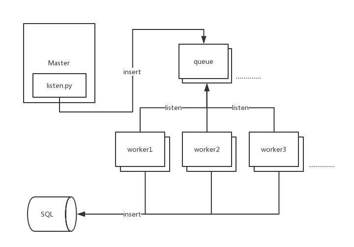

# salt\_return_rewrite

Rewrite saltstack return function，filter redundant，reduce the frequency of the write database.

Looking further down, it will be found that there is a very small part of structure that we use in this framework. Each part of role can be changed and create a customized tool according to different needs.

## Framework



* 1、Script listen.py at Master listening the Salt Event. Put this script at master or syndic. 
* 2、Listen to the event and insert the queues.  
* 3、Worker listening the queues. Put the worker and queues at anywhere so that reduce the load of main control
* 4、It will do something and insert SQL if Worker receives a task from the queues

### Custom

* If you have lots of business. Create a variety of Worker and Queue. 
* You can replace the message queue according to your own needs, such as redis, RabbitMQ. 
* At this script, listen the event which return the ’cmd.run‘ result. As a general function, any event could be listened by modifying listener field.
* You can also replace listen as long as you identified what needs to be put into the queue, then the workers will be handled. 
* Before insert the database, you can customize anything, such as send e-mail and make phone call.
* Finally, you can replace any part as long as the producer, consumer, message agent and queue are confirmed.

## Requirements

* CentOS 6x+
* python 2.6+
* easy_install
* pip
* celery
* redis

## Deploy

### Installation

#### 1、Install by 'setup.sh'

```
sh setup.sh
```

#### 2、Install by yum & pip

```
yum install mysql-devel
curl https://bootstrap.pypa.io/ez_setup.py -o - | python
easy_install pip
pip install -r requirements.txt
cd src && sh control restart
```

##### The requirements.txt info

```
redis==2.10.3
celery==3.1.19
MySQL-python
```

### Config

#### 1、control
* APP_DIR：The path to the log and pid files.
* QUEUES：Listen queue
* CELERY_APP：Specifying app or scripts
* CELERYD_OPTS：Process count

#### 2、cfg.ini
* redis_url: Redis IP and Port
* host: Mysql host IP
* user: Mysql username
* passwd: Mysql password
* db: Mysql database name
* port: Mysql port

## Usage

### 1、listen.py

We use the Supervisor to start the script. Supervisor is a client/server system that allows its users monitor and control a number of processes on UNIX-like operating systems.

Supervisor config info(salt-return-ext.cfg)

```
[program:salt-return-ext]
command= python script path
autostart = true
startsecs = 5
user = user
redirect_stderr = true
stdout_logfile=log file path
```

You can use this tool to ensure the script is running, you also can use other tools. 

### 2、Worker and Queue

#### Start agent

```
sh control start
```

#### Stop agent

```
sh control stop
```
You can see the log at celery\_control.APP_DIR where you set path.

## Developing and Contributing
You're highly encouraged to participate in our development. Please submit Issues and Pull Requests with pleasure.

## Support and Community

### QQ Group
Join our official Open Source QQ Group 394256506.

### Mail
Contact us by <394256506@qq.com>


### Bug Track
If you have any suggestions, bug reports, or annoyances please report them to our issue tracker at <https://github.com/Dtap117/salt_return_rewrite/issues>

### Wiki
<https://github.com/Dtap117/salt_return_rewrite/wiki>


<!--### Blog
The official blog of our team http://autohomeops.corpautohome.com-->

### License
This software is licensed under the Apache License. See the LICENSE file in the top distribution directory for the full license text.
